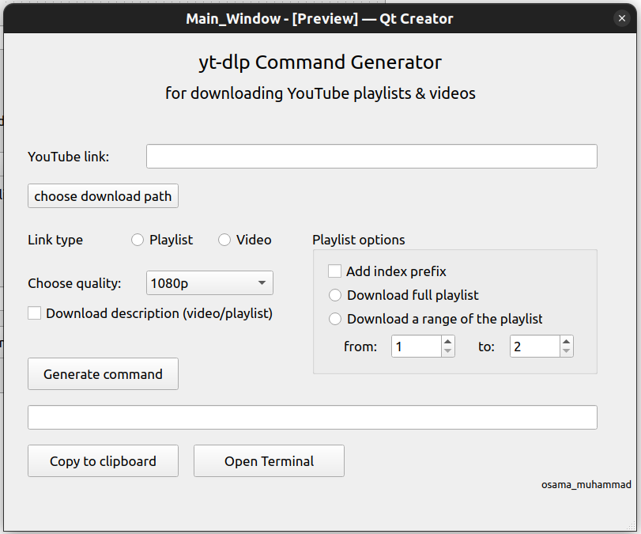

# yt-dlp YouTube Downloader Command Generator

yt-dlp is an open source command line application to download videos and full playlists with all kind of options.  
yt-dlp GitHub repo link: https://github.com/yt-dlp/yt-dlp

-- The application aims to generate the yt-dlp command with the most used options.

## Application features
1. Download a playlist or a single video.
2. Choose what video quality to download (audio only, 360/480/720/1080p).  
You have to make sure that the video is available in the quality you choose (do not choose 1080p for a 720p video).
3. Choose whether you want to download the whole playlist of a range of it.
4. Choose the download path.
5. Copy the generated command to the clipboard.

## How to use
1. Go to yt-dlp repo and download the lastest Windows release.
2. Download & launch this application and enter the required data & generate the command.
3. open you terminal/CMD/Windows PowerShell in yt-dlp directory, and paste the generated command.

## Interface screenshot

